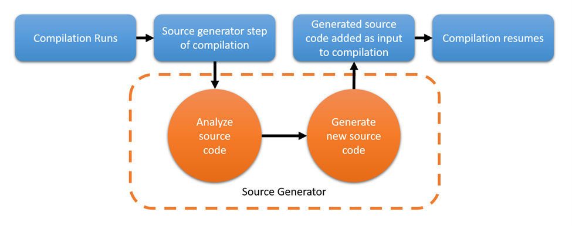

<!-- _class: lead -->
# Source Generators

Let's generate all the source!


---
<!-- _class: center -->

# What is source generators



---

# But what is a source generator

- .NET standard 2.0 library
- Generates code by analyzing C# and additional files
- Extends user code by generating partial classes and methods
- Runs live while you code
- Installed by using a nuget package

---

# Anatomy of a source generator

```csharp
[Generator]
public class HelloSourceGenerator : ISourceGenerator
{
    public void Initialize(GeneratorInitializationContext context)
    {
        // Initialize code here
    }
    
    public void Execute(GeneratorExecutionContext context)
    {
        // Generating extra code here
    }
}
```

---
<!-- _class: lead -->

# DEMO

---

<!-- _class: invert lead -->

# Questions?
